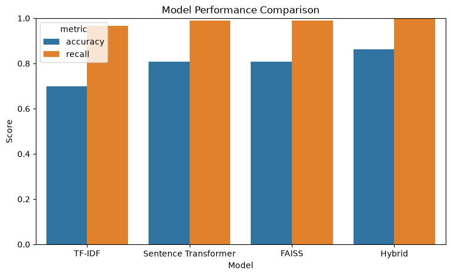
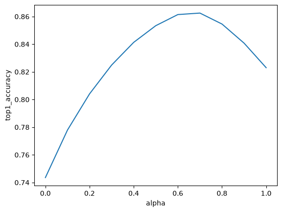

# Support Ticket to Knowledge Base Article Matcher — Semantic Search & Information Retrieval with TF-IDF and Sentence Transformers

A Python information retrieval project that automatically matches customer support tickets to the most relevant knowledge base (KB) articles. Compares four retrieval approaches — TF-IDF cosine similarity, sentence-transformer embeddings, FAISS approximate nearest-neighbor search, and a tuned hybrid model — on a real customer-support intent taxonomy.

**Keywords:** semantic search, information retrieval, text similarity, TF-IDF, sentence embeddings, sentence-transformers, FAISS, cosine similarity, vector search, customer support automation, knowledge base retrieval, NLP ranking, hybrid retrieval, scikit-learn, Python.

---

## Table of Contents

- [Overview](#overview)
- [Approaches Compared](#approaches-compared)
- [Results](#results)
- [Dataset](#dataset)
- [How It Works](#how-it-works)
- [Limitations](#limitations)
- [Tech Stack](#tech-stack)

---

## Overview

Support teams often maintain a knowledge base of articles that already answer common customer questions — the challenge is surfacing the *right* article for a given ticket automatically. This project builds and benchmarks a semantic search pipeline that ranks knowledge base articles by relevance to an incoming support ticket, without requiring any model training or fine-tuning.

The project is built **evaluation-first**: every retrieval method is measured against the same metrics before being compared, so improvements are demonstrable rather than assumed.

## Approaches Compared

| Method | Description |
|---|---|
| **TF-IDF + Cosine Similarity** | Classic sparse-vector retrieval using term frequency–inverse document frequency weighting |
| **Sentence Transformers** | Dense embedding retrieval using `all-MiniLM-L6-v2`, a compact encoder-only transformer model |
| **FAISS** | Approximate nearest-neighbor vector search (`IndexFlatIP`) over normalized sentence embeddings for fast cosine-equivalent retrieval |
| **Hybrid** | Weighted combination of normalized TF-IDF and embedding similarity scores, with the weight (alpha) tuned on a held-out split |

## Results

| Model | Top-1 Accuracy | Recall@5 |
|---|---|---|
| TF-IDF + Cosine Similarity | 	0.699650 | 0.967215 |
| Sentence Transformer (MiniLM) | 0.807792 | 	0.990325 |
| FAISS (IndexFlatIP) | 0.807792 | 0.990325 |
| **Hybrid (TF-IDF + Embeddings)** | **0.862496** | **0.998288** |

*Hybrid alpha (0.70) was selected on a held-out tuning split and the reported accuracy/recall come from a disjoint test split, to avoid tuning and evaluating on the same data.*

## Dataset

Built on the [Bitext Customer Support LLM Chatbot Training Dataset](https://huggingface.co/datasets/bitext/Bitext-customer-support-llm-chatbot-training-dataset) — ~26.9K customer support instructions covering 27 intents across 10 categories (orders, refunds, accounts, payments, etc.).

- **Tickets** = the dataset's `instruction` rows (realistic customer messages)
- **Knowledge base articles** = 27 synthesized articles, one per intent, built by aggregating representative `response` examples for that intent

## How It Works

1. Build KB articles by grouping and sampling `response` text per intent
2. Vectorize tickets and articles using TF-IDF and sentence-transformer embeddings
3. Rank KB articles for each ticket by cosine similarity
4. Combine TF-IDF and embedding scores into a tuned hybrid ranking
5. Evaluate all methods on Top-1 Accuracy and Recall@5

## Limitations

Retrieval accuracy is validated against each ticket's original `intent` label as a proxy for relevance, not against a human-labeled graded relevance set. As a result, ranking-quality metrics that require graded relevance (such as NDCG@10) were not computed — Top-1 Accuracy and Recall@5 are reported instead. A natural extension is pooling top-k results across methods and hand-labeling a small sample (relevant / partial / not relevant) to validate this proxy and enable graded ranking metrics like Precision@5, MRR, and NDCG@10.

No UI was built for this project by design — the notebook and results table above are the complete deliverable.

## Tech Stack

Python · pandas · scikit-learn (TF-IDF, cosine similarity) · sentence-transformers (`all-MiniLM-L6-v2`) · FAISS · matplotlib · seaborn